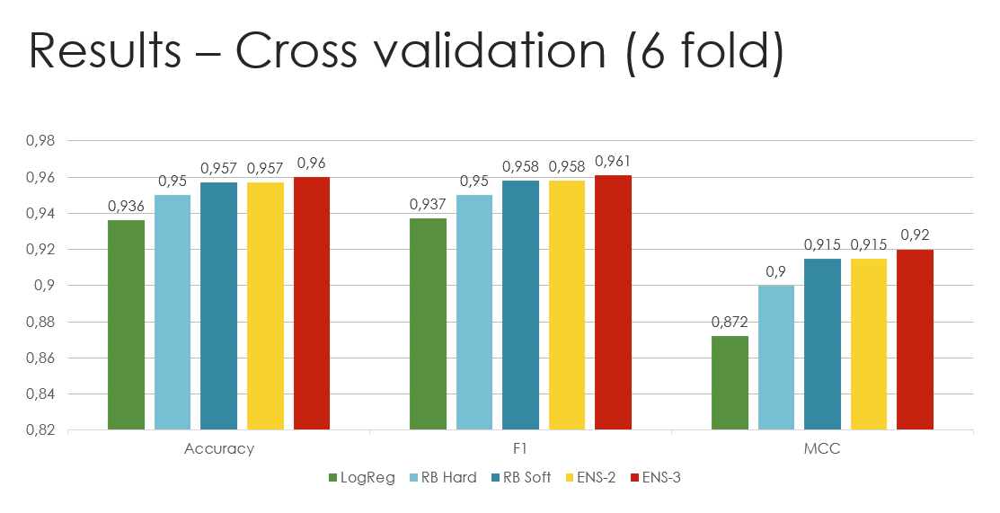

# Negative News Neural Nets (4N)

Authors:
* Dan Pavlovič
* Darya Pisetskaya

Folder `ItDS_ProjectPlan` contains project plan for DS homework. All relevant code and data can be found in `project` folder. 

## Introduction

All financial organizations need to do compliance investigations on their customers. Looking for adverse media, also known as negative news screening on people and organizations who are our customers aids in these investigations.

Looking for adverse media is expensive - be it paying for specialists to search and read through the news on SERP (Search Engine Results Page) manually or paying for an external API to do the same automatically. 

Even more importantly, as any whitepaper or marketing article of any adverse media api will tell you, since manual adverse media checks are slow, they might miss the important news article on page 42 of the search engine results. This would result in a subpar fight against financial crime by allowing unwanted entities to move money across the globe. 

The only way for fintech startups and others to grow scalably is to build a solution to do these checks automatically in-house. This project is the start of a long-running effort towards that solution. The final solution of this project will provide a shortlist of negative news on a given organization / person name.

## Project

### Data

`data` folder contains 5 datasets:

* `am.csv` - adverse media dataset
* `nam.csv` - non-adverse media dataset
* `am_additional.csv` - additional adverse media daaset to balance the data
* `random.csv` - random media dataset
* `test.csv` - test dataset with adverse, nonadverse and random articles 
 
First four datasets are used for training and cross-validation, data in `test.csv` is used for evaluation and selection of the best models. Later, models are trained on `test.csv` data as well and tested on private test data.

### Preprocessing

* `data_preprocess.py` - functions for data preprocessing. These functions cen be imported in python scripts and notebooks and used to preprocess the data.

* `Preprocessing.ipynb` - code from `data_preprocess.py`, its descriptions and usage examples.

### Models

Folders `ensemble`, `roberta`, `logistic_regression` and `other_models` contain scripts that were used for chosing the best models. First, we've tried Naive Bayes and BERT models, then Logistic Regression and Logistic Regression ensembles, Doc2Vec + Logistic Regression and RoBERTa. Since Logistic Regression and RoBERTa gave the best results, we chose them to build ensembles.

`ensemble` folder has 2 files in it:
* `Ensemble_Roberta+LR.ipynb`- 6-fold cross-validation for Logistic regression + RoBERTa trained on all ensemble and its results.
* `Ensemble_Roberta_title_body+LR.ipynb.`- 6-fold cross-validation for Logistic regression + RoBERTa trained on article titles + RoBERTa trained on article texts and its results.

`roberta` folder contains 3 files:
* `robertabase.ipynb` has code for 6-fold cross validation for RoBERTa trained on different inputs. This notebook is using hard voting on sliding windows. 
* `hyperparams_roberta.ipynb` contains code for RoBERTa hyperparameter tuning using sweep and it's results.
* `RobertaSoftVoting.ipynb` has code for 6-fold cross validation for RoBERTa with soft voting on sliding windows.

`logistic_regression` folder contains 4 files:
* `LogisticRegressionResults.ipynb` - 6-fold cross-validation of Logistic regression trained on different inputs.
* `HyperparameterTesting.ipynb` - logistic Regression hyperparameter testing.
* `LogisticRegressionEnsembles.ipynb` - 6-fold cross-validation with different Logistic Regression ensembles. 
* `doc2vec.ipynb` - Doc2Vec model + Logistic regression trainig, 6-fold cross-validation results and hyperparameter tuning.

`other_models` folder includes two files:
* `NaiveBayes.ipynb` - 6-fold cross-validation for Naive Bayes
* `bertbase.ipynb` - 6-fold cross validation for BERT trained on different inputs.

`performance` folder contains one file, `Performance.ipynb`. This file includes code for training our best models and timing evaluation time on test set.

Some notebooks were run in Google Colab and therefore cannot be run here. Such notebooks include respective warnings. Data referenced in the notebooks is identical to data in data folder 

## Results

